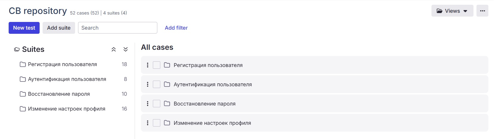
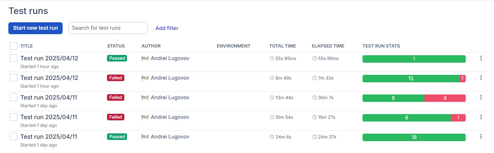
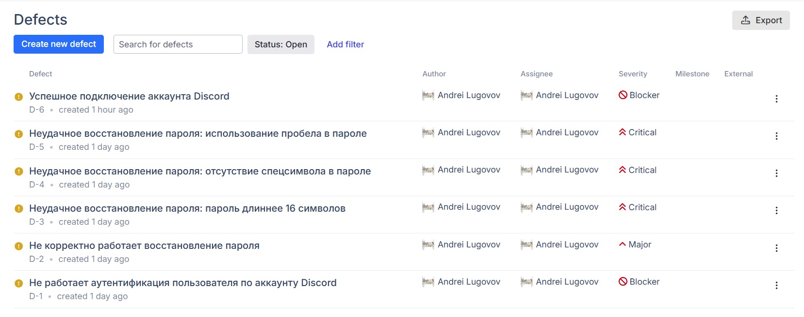

### Hexlet tests and linter status:

# Testing in production

## Description

The project involves testing the **Codebattle website**.

**Codebattle** - is a game where two programmers simultaneously solve the same task using different programming languages. The one who finishes first wins.

Key features of the game:

- Compete in solving tasks for speed against another player. Both players can see each other's code editors and test outputs, and they can switch programming languages during the game
- You can play with anyone — a random opponent, a bot, or a friend (the game will be available via a link).
- Choose a game based on difficulty level. When creating a game, you can select a specific task, or one will be chosen at random.
- Tasks are available in both Russian and English.
- Other users can watch games in progress.
- The game includes a chat for registered users to communicate.
- Finished games are available as replays. The code editor looks like a playback interface.
- Users earn points, which contribute to leaderboards for the week, month, and all time.

The website testing is carried out in several stages:

- Defining website requirements based on analysis of the working project and its documentation
- Creating a test plan
- Performing test design and writing test cases according to the plan
- Conducting testing
- Performing regression testing
- Preparing a bug report and a test report
- Creating test documentation in Qase.io

## Demonstration:

- Test cases:

  

---

- Test runs:

  

---

- Bug reports:

  

---

### Click [here](https://codebattle.hexlet.io/) to view Codebattle.

### Click [here](https://drive.google.com/file/d/1-GgJs6HZRRSecTvxt8ad0AwUSqfsseSO/view?usp=sharing) to view the test cases on Qase.io.

### Click [here](https://drive.google.com/file/d/1n4o9le-I-QwzJwy4-x7kyJhY-Tgti6Fx/view?usp=sharing) to view one of the test runs on Qase.io.
